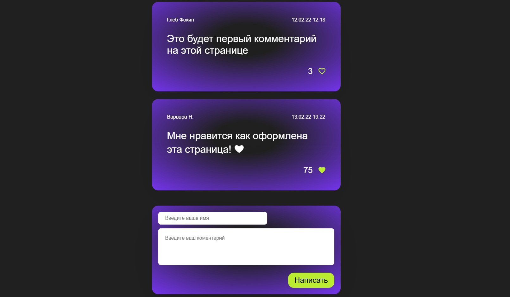

# 💬 Интерактивный проект "Комментарии"

Современный и легкий интерфейс для добавления сообщений, созданный на JavaScript. Проект демонстрирует навыки динамического управления элементами страницы (DOM) и создания отзывчивого пользовательского интерфейса (UI).

## 📷 Скриншоты и Демо

## 🚀 Главные фишки проекта
* **Мгновенная отправка:** новые сообщения добавляются в ленту в реальном времени без перезагрузки страницы.
* **Умная валидация:** система проверяет заполнение полей. Пустые строки подсвечиваются ошибкой, а блокировка автоматически снимается, как только пользователь начинает вводить текст.
* **Работа с датой и временем:** каждое сообщение получает точный штамп времени в красивом формате `ДД.ММ.ГГ ЧЧ:ММ` благодаря объекту `Date`.

## 💻 Технологии
* **Разметка и стиль:** HTML5, CSS3 (адаптивная сетка, анимация уведомлений).
* **Логика работы:** чистый JavaScript — обработка событий, динамическое создание HTML-шаблонов сообщений.

## 🚀 Как запустить
1. Скопируйте репозиторий или скачайте архив.
2. Откройте файл `index.html` в любом браузере.